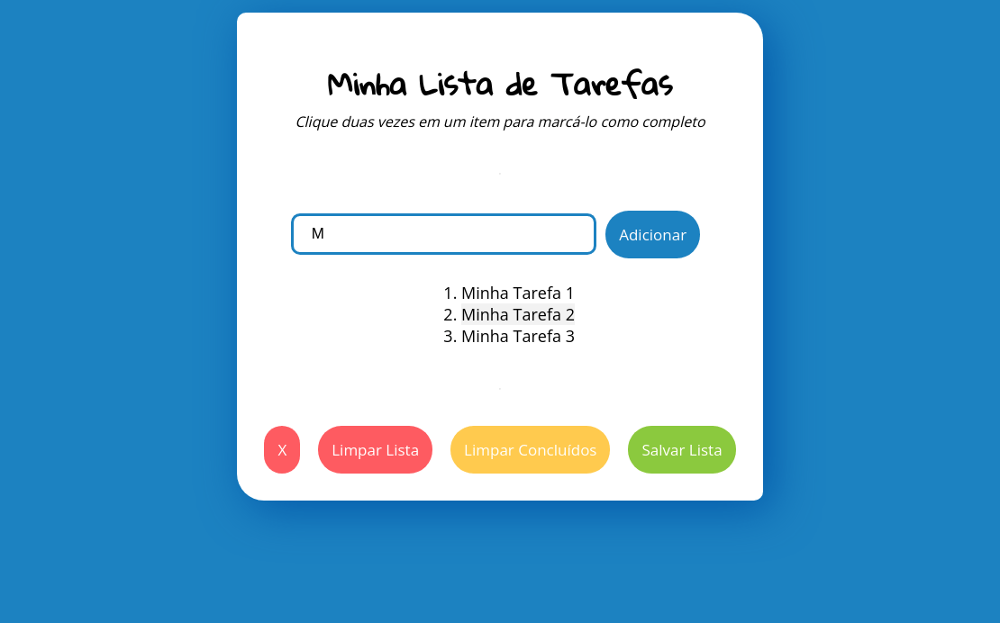

# Projeto To Do List

Aplicação web de lista de tarefas, com opções de adicionar item, marcar como concluído e remover. 

 <a href="https://diogoaugusto.dev/to-do-list/">Clique aqui para conferir o Deploy.</a>

### 🛠 Tecnologias e Ferramentas Utilizadas:

- [x] HTML5
- [x] CSS3
- [x] JavaScript

 ### <a href="https://diogoaugusto.dev/" target="blank">👉 Clique e Confira meu Portfólio</a>

 ### 🤝 Conecte-se Comigo:

